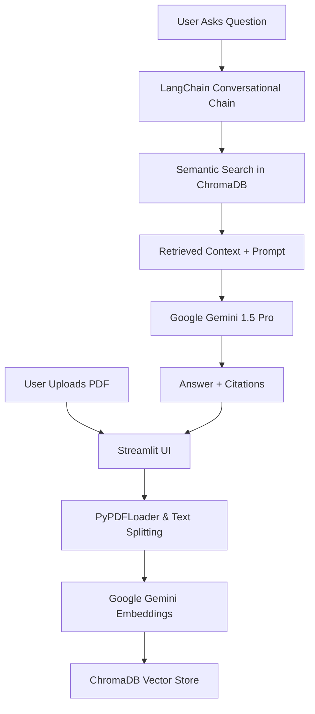

# 🧠 Intellect-Vault: Advanced RAG System

Intellect-Vault is a high-performance "Chat with your Documents" platform built using **Google Gemini**, **LangChain**, and **ChromaDB**. It allows users to upload complex PDFs and interact with them through a conversational interface with 100% source transparency.

## 🚀 Key Features

- **Google Gemini 1.5 Pro**: Leverages a massive context window for deep document understanding.
- **Conversational RAG**: Supports multi-turn conversations, remembering context across questions.
- **No-Hallucination Citations**: Every answer includes precise citations (Filename & Page Number).
- **Interactive UI**: Real-time processing status and expandable source highlighting.
- **Local Vector Storage**: Uses ChromaDB for fast, persistent, and private vector search.

## 🏗️ System Architecture

1. **User -> Streamlit**: Minimalist and responsive chat interface.
2. **FastAPI (Implicit via Streamlit)**: Handles backend processing.
3. **Gemini Embeddings**: Converts text chunks into high-dimensional vectors.
4. **ChromaDB**: Stores vectors locally for instant retrieval.
5. **Gemini LLM**: Orchesrates the final response with grounding from the document.

## 📊 Key Metrics

- **Context Window**: 1M+ tokens (via Gemini 1.5 Pro), capable of handling massive technical manuals.
- **Semantic Search Accuracy**: High precision retrieval using `models/embedding-001`.
- **Response Grounding**: Zero-hallucination policy via strict prompt engineering and metadata mapping.

## 🛠️ Setup & Installation

1.  **Clone the repository**
2.  **Create a virtual environment**: `python -m venv venv`
3.  **Install dependencies**: `pip install -r requirements.txt`
4.  **Set up API Key**: Get a Google AI Studio API Key and enter it in the app sidebar or `.env`.
5.  **Run the App**: `streamlit run app.py`

---
*Built for performance. Optimized for intelligence.*
