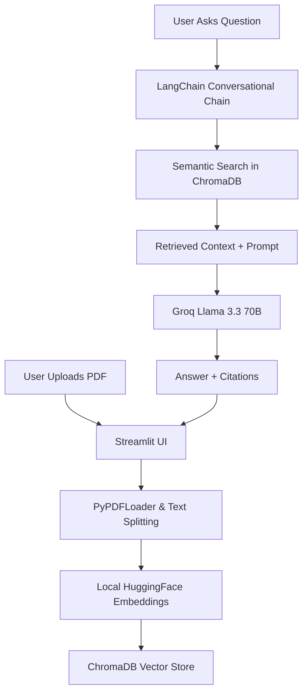

# 🧠 Intellect-Vault: Hybrid RAG System

Intellect-Vault is a high-performance "Chat with your Documents" platform built using **Groq Llama 3.3 70B**, **Local Embeddings**, **LangChain**, and **ChromaDB**. It allows users to upload complex PDFs and interact with them through a conversational interface with 100% source transparency and privacy-first architecture.

## 🚀 Key Features

- **⚡ Groq Llama 3.3 70B Versatile**: Ultra-fast LLM inference via Groq API for near-instant responses
- **🔒 Local Embeddings**: Privacy-first approach using HuggingFace `sentence-transformers/all-MiniLM-L6-v2` (no API calls for embeddings)
- **💬 Conversational RAG**: Supports multi-turn conversations with full context retention across questions
- **📚 No-Hallucination Citations**: Every answer includes precise citations with filename and page number
- **🎨 Interactive UI**: Real-time processing status, expandable source highlighting, and modern Streamlit interface
- **💾 Local Vector Storage**: Uses ChromaDB for fast, persistent, and completely private vector search
- **🔄 Hybrid Fallback**: Automatic fallback to Google Gemini embeddings if needed

## 🏗️ System Architecture



### Architecture Components:

1. **Streamlit UI**: Clean, responsive chat interface with real-time status updates
2. **Document Processing**: PyPDFLoader extracts text, RecursiveCharacterTextSplitter creates semantic chunks
3. **Local Embeddings**: `sentence-transformers/all-MiniLM-L6-v2` runs locally (CPU-optimized, no API required)
4. **ChromaDB**: Persistent local vector database for instant semantic retrieval
5. **Groq LLM**: Llama 3.3 70B Versatile model delivers fast, accurate responses with source grounding
6. **LangChain**: Orchestrates the ConversationalRetrievalChain with custom prompts for citation enforcement

## 📊 Key Metrics & Specifications

- **LLM Model**: Groq Llama 3.3 70B Versatile (temperature=0 for deterministic outputs)
- **Embedding Model**: `sentence-transformers/all-MiniLM-L6-v2` (384-dimensional vectors)
- **Retrieval**: Top-5 semantic search with metadata preservation
- **Context Window**: Supports large documents via chunking strategy
- **Response Grounding**: Zero-hallucination policy via strict prompt engineering and source document return
- **Privacy**: All embeddings generated locally, only LLM queries sent to Groq API

## 🛠️ Setup & Installation

1. **Clone the repository**
   ```bash
   git clone <your-repo-url>
   cd Intellect_Vault
   ```

2. **Create a virtual environment**
   ```bash
   python -m venv venv
   source venv/bin/activate  # On Windows: venv\Scripts\activate
   ```

3. **Install dependencies**
   ```bash
   pip install -r requirements.txt
   ```

4. **Set up API Key**
   - Get a free Groq API Key from [Groq Console](https://console.groq.com)
   - Enter it in the app sidebar, or create a `.env` file:
     ```
     GROQ_API_KEY=your_groq_api_key_here
     ```

5. **Run the App**
   ```bash
   streamlit run app.py
   ```

## 🔑 Environment Variables

Create a `.env` file in the root directory (optional, can also use sidebar):

```env
GROQ_API_KEY=your_groq_api_key_here
```

## 🎯 Usage

1. Launch the app and enter your Groq API key in the sidebar
2. Upload a PDF document using the file uploader
3. Click "Process Document" to vectorize and index the content
4. Ask questions in the chat interface
5. View source citations by expanding the "View Sources Used" section

---
*Built for performance. Optimized for intelligence.*
